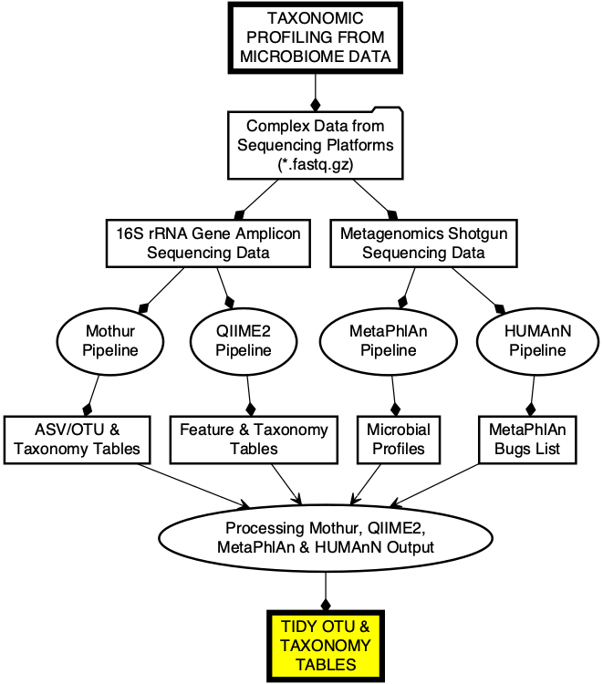

# iMAP-PART2 Bioinformatics Analysis of Microbiome Data

 

The <strong>iMAP-PART2</strong> is one of the practical user guide for providing analytical support to the microbiome research community. Explore more guides from the table below:

## Related resources

|Code| Description| Glimpse | Report |
|--------------------|---------------------------------------------|-----------|-------|
|[iMAP-PART2](https://github.com/tmbuza/iMAP-part2/) | How to Get Started with Microbiome Data Analysis |[GH-Page](https://tmbuza.github.io/iMAP-part2/) | [eBook](https://complexdatainsights.com/books/microbiome-analysis/bioinformatics-analysis) |

## Citation
Teresia M. Buza, Triza Tonui, Francesca Stomeo, Christian Tiambo, Robab Katani, Megan Schilling, Beatus Lyimo, Paul Gwakisa, Isabella M. Cattadori, Joram Buza and Vivek Kapur. iMAP: an integrated bioinformatics and visualization pipeline for microbiome data analysis. BMC Bioinformatics (2019) 20:374. [Free Full Text](https://rdcu.be/b5iVj).

