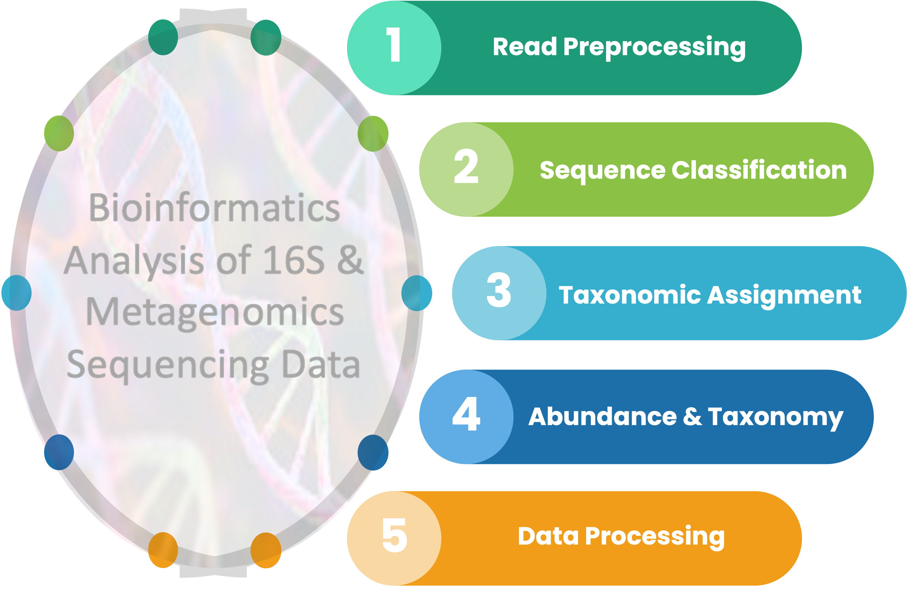

```{r pkgbiblib, include=FALSE}
knitr::write_bib(c(
  .packages(), 'base','bookdown','rmarkdown','tidyverse','shiny','vegan','data.table, dendextend, robCompositions, microbiome, ALDEx2, caret, rms, phyloseq'
), 'library/packages.bib')
```

```{r setup, echo=FALSE}
source(file = "R/common.R")
if (!dir.exists("data")) {dir.create("data")}
```

# Bioinformatics Analysis of Microbiome Data {-#frontpage}

```{r include=FALSE}
library(DiagrammeR)
library(DiagrammeRsvg)

graph <- DiagrammeR::grViz("
digraph {
graph [layout = dot, rankdir = TD]

node [
shape = box, 
style = filled, 
fillcolor = white, 
fontname = Helvetica,
penwidth = 2.0] 

edge [arrowhead = diamond]

A [label = 'TAXONOMIC \nPROFILING OF \nMICROBIOME DATA', fillcolor = white, penwidth = 5.0]
B [label = 'Complex Data from \nSequencing Platforms\n(*.fastq.gz)', shape = folder]
C [label = '16S rRNA Gene Amplicon\nSequencing Data']
D [label = 'Metagenomics Shotgun\nSequencing Data']
E [label = 'Mothur\nPipeline', shape = oval]
F [label = 'QIIME2\nPipeline', shape = oval]
G [label = 'MetaPhlAn\nPipeline', shape = oval]
H [label = 'HUMAnN\nPipeline', shape = oval]
I [label = 'ASV/OTU &\nTaxonomy Tables']
J [label = 'Feature & Taxonomy\nTables']
K [label = 'Microbial\nProfiles']
L [label = 'MetaPhlAn\nBugs List']
M [label = 'Tidying Mothur, QIIME2,\nMetaPhlAn & HUMAnN Output', shape = oval, penwidth = 2.0]
N [label = 'TIDY MICROBIAL\nABUNDANCE\nTABLES', shape = diamond, fillcolor = yellow, penwidth = 4.0]

A [color = black]
C,E,F,I,J [color = limegreen]
D,G,H,K,L [color = dodgerblue]

{A}  -> B
{B}  -> C
{B}  -> D
{C}  -> E
{C}  -> F
{D}  -> G
{D}  -> H
{E}  -> I
{F}  -> J
{G}  -> K
{H}  -> L
{I}  -> M [arrowhead = vee]
{J}  -> M [arrowhead = vee]
{K}  -> M [arrowhead = vee]
{L}  -> M [arrowhead = vee]
{M}  -> N 


}", height = 500, width = 500)

# 2. Convert to SVG, then save as png
part2_flow = DiagrammeRsvg::export_svg(graph)
part2_flow = charToRaw(part2_flow) # flatten
rsvg::rsvg_png(part2_flow, "img/part2_flow.png")
```


<a href=""></a>

## Quick Glimpse {-}
Investigating the role of microbial communities in health and disease requires a thorough knowledge of the entire analytical process. Using wrong approaches can cost a significant amount of dollars and lengthy process to achieve the desired results. This is <b>PART 2</b> of the practical user guides intended to provide analytical support to the microbiome research community. The entire guide is reproducible, allowing users to easily follow along. If interested, user may use this model to publish their findings in a book format.

## Structure of this guide {-}
This guide is divided into chapters to facilitate easy navigation. Each chapter contains several sections as displayed in the navigation bars on the left and right. Click the hyper-linked text if you want to jump into a specific chapter or section.

## Code availability {-}
The code that generated this guide is available at a public [GitHub repository](https://github.com/tmbuza/iMAP-part2/) or via a [GH-Page](https://tmbuza.github.io/iMAP-part2/). If interested you can request a consulting service by contacting the developer of this repo using <a href="https://complexdatainsights.com/contact-us">this contact form</a>. 